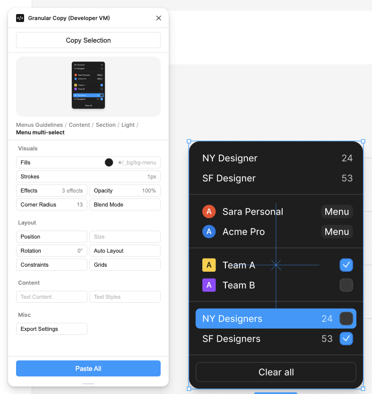
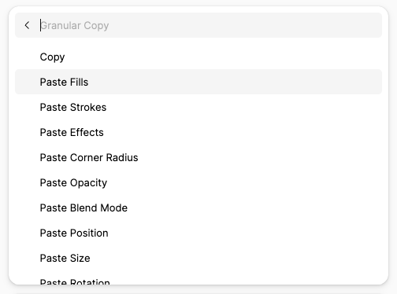

# Granular Copy for Figma


A Figma plugin that allows you to copy properties from one object and paste them
selectively (by "granule") onto others.





## Features

Copy properties once and paste what you need. Supports preserving **Variable
Bindings** and **Figma Styles** (paste-by-reference).

### Supported Properties

- **Fills:** Solid colors, gradients, images.
- **Strokes:** Weight, color, style (solid/dashed), and alignment.
- **Effects:** Shadows and blurs.
- **Corner Radius:** Independent and uniform smoothing.
- **Opacity & Blend Mode:** Layer transparency and blending.
- **Position & Size:** X/Y coordinates and pixel dimensions.
  - _Smart Sizing:_ Pasting "Size" between Auto Layout children applies the
    **Sizing Mode** (Hug/Fill/Fixed) instead of literal pixels.
- **Auto Layout:** Padding, gap, alignment, and wrapping.
- **Constraints & Grids:** Layout rules and column/row grids.
- **Text:** Content string and Text Styles (Font, size, weight, etc.).
- **Export Settings:** Format and scale factors.

## Interaction Model

### 1. Quick Actions (Keyboard-Centric)

The plugin is optimized for Figma's Quick Actions bar (**Cmd/Ctrl + /**).

- Run `Granular Copy: Copy` to grab properties.
- Run `Granular Copy: Paste [Property]` to apply a specific granule.
- Run `Granular Copy: Paste All` to apply everything compatible.

### 2. Persistent UI (Visual Palette)

Run `Granular Copy: Open Palette...` to open a floating window that displays:

- A **preview** of the source object.
- **Visual indicators** for what you are about to paste (color swatches, font
  names, pixel values).
- **Contextual buttons** that disable themselves if a property isn't supported
  by your current selection.

## Tech Stack

- **Language:** TypeScript
- **Frontend:** React
- **Build Tool:** Vite
- **Testing:** Vitest + React Testing Library
- **Linting/Formatting:** Biome

## Getting Started

### Installation

1. Clone this repository.
2. Install dependencies:
   ```bash
   npm install
   ```

### Development

Start the build process in watch mode:

```bash
# Watch main thread
npm run watch:main

# Watch UI (React)
npm run watch:ui
```

Then, in Figma:

1. Go to `Plugins` -> `Development` -> `Import plugin from manifest...`.
2. Select the `manifest.json` in this project folder.

### Building

Create a production build:

```bash
npm run build
```

## Testing

Run the test suite:

```bash
npm test
```

## License

MIT.
